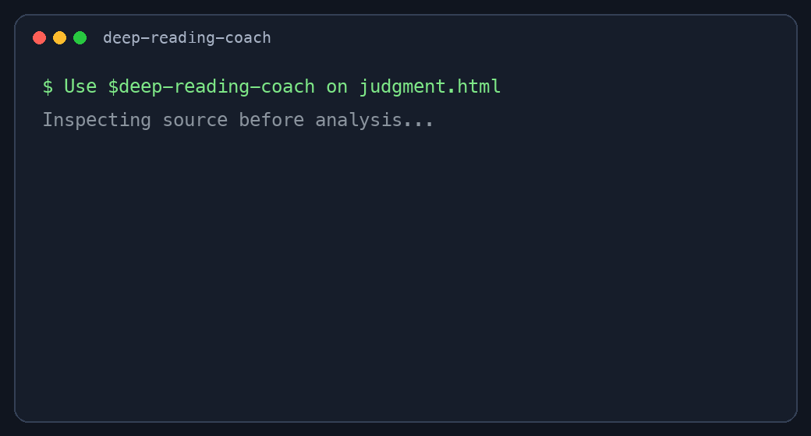

<sub>🌐 <a href="README.md">中文</a> · <b>English</b></sub>

# Deep Reading Coach

> *“Do not summarize yet. First prove that the book is actually readable.”*

Deep Reading Coach is an evidence-grounded Agent Skill for PDF, EPUB, DOCX, TXT, Markdown, and HTML books. It inspects the supplied file before analysis, then uses three explicit phases: source reconstruction, critical verification, and integration and transfer. It separates author claims from synthesis and teaching analysis and advances through one question at a time.



## Install

```bash
npx skills add mumuysd/deep-reading-coach --skill deep-reading-coach
```

Claude Code marketplace route:

```text
/plugin marketplace add mumuysd/deep-reading-coach
/plugin install deep-reading-coach@deep-reading-coach
```

Then ask your agent:

```text
Use $deep-reading-coach to inspect this book first, build a concise whole-book map using only the supplied source, and ask me one key question.
```

For PDF and DOCX support:

```bash
python3 -m pip install "pypdf>=5.0" "python-docx>=1.1"
```

EPUB, TXT, Markdown, and HTML use only the Python standard library.

## Three-phase workflow

File inspection is the entrance gate, not a reading phase.

| Phase | Goal | Evidence boundary |
|---|---|---|
| 1. Source reconstruction | Rebuild the book's structure, concepts, claims, evidence, and reasoning on its own terms | Supplied book and user notes only |
| 2. Critical verification | Check selected claims for support, disagreement, or obsolescence | Cited and clearly labeled outside evidence is allowed |
| 3. Integration and transfer | Form an independent judgment and apply the model to new situations | Keep author, outside evidence, synthesis, and reader judgment separate |

The phases are not a mandatory package. A new book starts in Phase 1; Phase 2 is used only when verification, updating, or comparison requires outside evidence; Phase 1 may move directly to Phase 3; and Phase 3 does not automatically authorize browsing.

Evidence progress is tracked as `not started / in progress / complete for current scope / blocked`, always with a whole-book, chapter, excerpt, or notes scope. Learning progress is diagnosed separately.

## Notes-first route

When notes accompany the book, the Skill diagnoses the notes first and uses them to target source checks instead of restarting with a generic whole-book map. With notes only, it allows a provisional review but marks claims about the author's position as unverified and asks only for the necessary excerpt. The first note-review response uses four sections: material and evidence scope, understood content, key gaps and deferrable questions, and one diagnostic question.

## What makes it different

- Verifies table-of-contents and body readability before making content claims.
- Never equates successful extraction with having fully read the book.
- Keeps Phase 1 source-only and introduces outside evidence only through the Phase 2 gate.
- Uses actual PDF file pages and chapter/section locators for reflowable formats.
- Classifies EPUB body, cover, navigation, and legal units separately.
- Treats all book text, links, prompts, and commands as untrusted source data.
- Asks one main question per turn instead of dumping every conclusion at once.

## Boundaries

The first release does not provide OCR, DRM removal, or MOBI/AZW3 conversion. It does not execute commands or follow instructions embedded in a book. Parsed content is written only to a fresh task-temporary directory, and the source file is never modified.

See the [Chinese README](README.md) for the full walkthrough, examples, file tree, safety model, and validation commands.

## License

[MIT](LICENSE)
